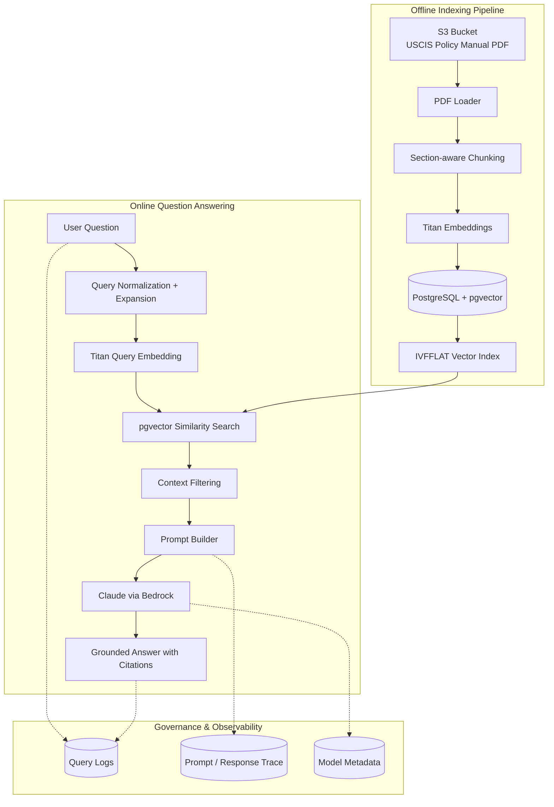

## Project Overview

USCIS Policy RAG is a Retrieval-Augmented Generation system that enables semantic search and question answering over USCIS policy manuals using:

- Amazon Bedrock (Claude Sonnet) for answer generation
- Amazon Titan embeddings for semantic search
- PostgreSQL + pgvector for vector storage
- S3-based document ingestion pipeline
- Python CLI interface for querying

---

## USCIS Policy RAG — System Architecture

This system indexes the USCIS Policy Manual and enables grounded question answering using Amazon Titan embeddings, PostgreSQL + pgvector vector search, and Claude on Bedrock.




## Example Query and Output

Below is an example interaction with the USCIS Policy RAG system.

### Question

```
What are the eligibility requirements for naturalization?
```
### Answer

```
To qualify for naturalization, an applicant must generally:

• Be at least 18 years old  
• Be a lawful permanent resident  
• Maintain continuous residence in the United States  
• Demonstrate physical presence in the U.S. for the required period  
• Demonstrate good moral character  
• Pass the English and civics tests  
• Take an oath of allegiance to the United States
```

### Retrieved Evidence

```
USCIS Policy Manual | Volume 12 | Part D | Chapter 2
Similarity: 0.92

"A naturalization applicant must meet several statutory requirements including lawful permanent residence, continuous residence, physical presence, and good moral character."
```
The system retrieves relevant policy sections using semantic search (pgvector + Amazon Titan embeddings) and generates grounded answers using Claude via Amazon Bedrock.


## Engineering Design Decisions


This project intentionally prioritizes a simple, transparent RAG architecture that can run locally while demonstrating production-grade concepts.

### Why PostgreSQL + pgvector

Instead of using a hosted vector database, this project uses PostgreSQL with the pgvector extension.

Benefits:

• avoids external vector DB dependencies  
• simplifies local development  
• demonstrates how semantic search can run inside standard relational systems  

The IVFFLAT index is used to accelerate approximate nearest-neighbor search
for embedding similarity queries.

---

### Why Amazon Titan Embeddings

Amazon Titan embeddings provide:

• strong semantic search performance  
• tight integration with AWS Bedrock  
• compatibility with enterprise environments  

Embeddings are stored as 1024-dimension vectors inside PostgreSQL.

---

### Why Retrieval-Augmented Generation (RAG)

Large language models can hallucinate when answering domain-specific
questions.

RAG mitigates this risk by:

1. retrieving relevant policy sections first
2. passing those sections as context to the language model
3. constraining the model to answer based on retrieved evidence

This enables grounded answers with traceable citations.

---

### Section-Aware Chunking

USCIS policy manuals contain long legal sections.

Instead of naive chunking, this project applies section-aware splitting
so that semantic meaning remains intact.

This improves retrieval quality and reduces hallucination risk.

---

### Context Filtering

Retrieved chunks are filtered using a similarity threshold before being
sent to the language model.

This prevents irrelevant passages from polluting the prompt and improves
answer precision.

---

## Local Development Setup

Clone the repository:

```bash
git clone https://github.com/<your-username>/uscis-policy-rag.git
cd uscis-policy-rag
```

Create a virtual environment:

```bash
python3 -m venv venv
source venv/bin/activate
```

Install dependencies:

```bash
pip install -r requirements.txt
```

Create a `.env` file based on `.env.example`:

```bash
cp .env.example .env
```

Run tests:
```bash
pytest
```

## Database Setup with Docker

Start PostgreSQL + pgvector:

```bash
docker compose up -d
```
Verify the container is running:
```bash
docker ps
```
Connect to PostgreSQL inside the container:
```bash
docker exec -it uscis-rag-postgres psql -U postgres -d uscis_rag
```
Enable the pgvector extension:
```SQL
CREATE EXTENSION IF NOT EXISTS vector;
```
Verify the extension is installed:
```sql
\dx
```
Exit PostgreSQL:
```SQL
\q
```
 
## Verify Database Connection

Run the database check script:
```bash
python -m scripts.check_db
```

## Test Document Ingestion

Upload at least one USCIS PDF to the configured S3 bucket and prefix, then run:

```bash
python -m scripts.test_ingestion
```
