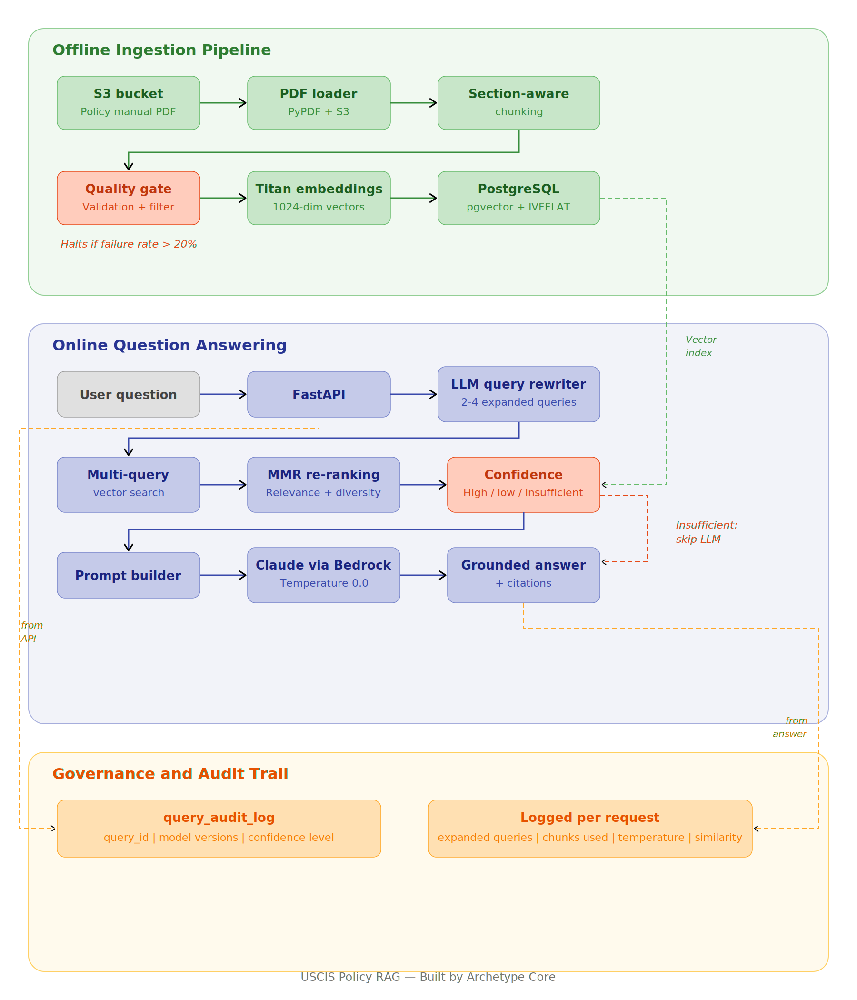
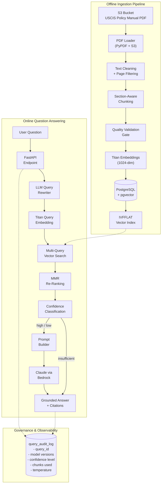

# Audit-Ready RAG System
*Applied to USCIS policy documents*

A Retrieval-Augmented Generation system designed for environments where answers must be traceable, reproducible, and defensible.

It demonstrates what trustworthy AI infrastructure looks like under real-world constraints.

---

## Why This Exists

Most RAG systems can generate answers.

Very few can explain them.

In regulated or high-risk environments, that’s not acceptable.

This system makes every answer traceable, inspectable, and reproducible.

**Stack:** AWS Bedrock (Claude Sonnet) | Amazon Titan Embeddings | PostgreSQL + pgvector | FastAPI | Docker


*Architecture overview showing ingestion, retrieval, and governance layers.*

---

## System Capabilities

This system indexes the USCIS Policy Manual and answers questions with grounded, citation-backed responses.

Each response includes source citations, a confidence level, and a query audit record.

### Key Capabilities

- **LLM-powered query rewriting** translates casual questions into precise immigration terminology  
- **Maximal Marginal Relevance (MMR)** selects chunks that are both relevant and diverse  
- **Three-tier confidence classification** (high, low, insufficient) indicates how reliable the retrieved results are  
- **Full audit trail** logs every query with model version, embeddings, temperature, expanded queries, and contributing chunks  
- **Chunk quality validation** filters out corrupted text, noisy extractions, and missing metadata before indexing  
- **Section-aware chunking** preserves legal document structure (Volume > Part > Chapter > subsection)  

---

## System Architecture



---

## Example Output

### High confidence query

```
Question: What are the eligibility requirements for naturalization?

Confidence: HIGH
Top Similarity: 0.8247

Answer:
The general eligibility requirements for naturalization under USCIS policy
are as follows:

1. Lawful Permanent Resident (LPR) Status
2. Continuous Residence (generally five years)
3. Physical Presence (at least 30 months out of five years)
4. State/District Residency (at least three months prior to filing)
5. Good Moral Character (five years prior to filing through Oath)
6. Attachment to Constitutional Principles
7. English Language and Civics Knowledge

Sources:
  - USCIS Policy Manual Full 2026, PDF Page 2330 (sim: 0.8247)
  - USCIS Policy Manual Full 2026, PDF Page 2330 (sim: 0.8106)
  - USCIS Policy Manual Full 2026, PDF Page 2421 (sim: 0.7968)

Expanded Queries:
  - eligibility requirements for naturalization
  - continuous residence and physical presence requirements
  - good moral character standards for naturalization

Audit ID: 279eeb75-f96f-4709-8a8a-a94ae08aba5e
```

### Off-topic query (insufficient confidence)

```
Question: What is the best pizza in New York?

Confidence: INSUFFICIENT
Top Similarity: 0.1038

Answer:
I do not have enough information from the USCIS Policy Manual
to answer this question reliably.

Sources: None
Chunks Sent to Model: 0
```

The system identified an off-topic question, skipped the LLM call, and returned a fallback response.

Both queries were logged with full traceability.

---

## Engineering Design Decisions

### Why PostgreSQL + pgvector (Not a Hosted Vector DB)

Using PostgreSQL with pgvector avoids external vector database dependencies, simplifies local development, and keeps semantic search inside standard relational infrastructure. In enterprise and federal environments, adding another managed service creates procurement and compliance overhead. Keeping vectors in Postgres means one database to secure, back up, and audit. 

The IVFFLAT index accelerates approximate nearest-neighbor search with configurable probe depth for tuning recall vs. latency.

### Why LLM Query Rewriting (Not Hardcoded Normalization)

Early versions of this system used a 180-line if/elif chain to map casual language to search terms. This worked for known phrasings but failed on anything not anticipated. The current system uses Claude to rewrite user questions into precise USCIS terminology and expand them into 2-4 related queries, with a graceful fallback to the original question if the rewriter fails.

### Why MMR Re-Ranking

Standard cosine similarity retrieval often returns near-duplicate chunks from the same section. MMR (Maximal Marginal Relevance) balances relevance with diversity: each selected chunk must be similar to the query but dissimilar to chunks already selected. This produces a more informative context window for the LLM.

### Why Confidence Tiers

Not all retrieval results are equal. Rather than sending low-quality context to the model and hoping for the best, this system classifies retrieval confidence into three tiers:

- **High** (similarity >= 0.70): Strong match. Answer generated normally.
- **Low** (similarity >= 0.50): Partial match. Answer prefixed with an uncertainty notice.
- **Insufficient** (below 0.50): No usable context. Returns a clear "I don't have enough information" response without calling the LLM.

This prevents hallucinations on out-of-scope questions and provides a clear confidence signal for downstream systems.

### Why a Quality Validation Gate

PDF extraction is inherently noisy. Before chunks are written to the vector store, they pass through validation checks: minimum and maximum length, text-to-noise ratio, repeated character detection (corrupted OCR), heading integrity, and metadata completeness. If the overall failure rate exceeds 20%, the ingestion pipeline halts. This catches extraction problems before they degrade retrieval quality.

### Why a Full Audit Trail

In regulated environments, simply returning the correct answer is not enough. You need to prove which model generated the answer, what temperature was used, which chunks informed it, what the retrieval confidence was, and what queries were actually searched. The `query_audit_log` table captures all of this for every request, indexed by a unique `query_id` for downstream traceability.

---

## Quick Start

### Prerequisites

- Python 3.12+
- Docker and Docker Compose
- AWS account with Bedrock access (Claude Sonnet + Titan Embeddings enabled)

### Setup

```bash
git clone https://github.com/marlungu/audit-ready-rag-system.git
cd audit-ready-rag-system

python3 -m venv venv
source venv/bin/activate
pip install -r requirements.txt

cp .env.example .env
# Edit .env with your AWS credentials and S3 bucket
```

### Start Infrastructure

```bash
make db-up          # Start PostgreSQL + pgvector
make init-db        # Create tables and indexes
```

### Ingest Documents

Upload the USCIS Policy Manual PDF to your S3 bucket, then:

```bash
make ingest         # Load, chunk, validate, embed, and store
```

### Run

```bash
make serve          # Start FastAPI on port 8000
make ask            # Interactive CLI
```

### Test

```bash
make test           # Run 44 unit tests
make evaluate       # Run evaluation harness with known Q&A pairs
```

### Full Stack (Docker)

```bash
make dev            # Build and start app + postgres
```

---

## Manual Setup (Without Make)

If you prefer to run commands directly instead of using the Makefile, or want to understand each step individually:

### Clone and Install

```bash
git clone https://github.com/marlungu/audit-ready-rag-system.git
cd audit-ready-rag-system

python3 -m venv venv
source venv/bin/activate
pip install -r requirements.txt

cp .env.example .env
# Edit .env with your AWS credentials and S3 bucket
```

### Start PostgreSQL + pgvector

```bash
docker compose up -d
```

Verify the container is running:

```bash
docker ps
```

### Initialize the Database

```bash
python -m scripts.init_db
```

This creates the `document_chunks` table, `query_audit_log` table, and IVFFLAT vector index. To verify the schema was created:

```bash
docker exec -it uscis-rag-postgres psql -U postgres -d uscis_rag -c "\dt"
```

You should see three tables: `document_chunks`, `query_audit_log`, and `query_logs`.

### Verify Database Connection

```bash
python -m scripts.check_db
```

### Ingest Documents

Upload at least one USCIS PDF to the configured S3 bucket and prefix, then:

```bash
python -m scripts.embed_documents
```

This will load pages from S3, chunk them with section-aware splitting, run quality validation, and embed the valid chunks into PostgreSQL. Watch for the quality report in the output.

### Start the API Server

```bash
uvicorn app.main:app --reload --host 0.0.0.0 --port 8000
```

Test the health endpoint:

```bash
curl http://localhost:8000/health | python3 -m json.tool
```

### Run the Interactive CLI

```bash
python -m scripts.ask
```

### Run Tests

```bash
python -m pytest tests/ -v
```

---

## API Reference

### `POST /query`

```json
{
  "question": "What are the eligibility requirements for naturalization?",
  "top_k": 5
}
```

**Response:**

```json
{
  "question": "What are the eligibility requirements for naturalization?",
  "answer": "The general eligibility requirements for naturalization...",
  "confidence": "high",
  "sources": [
    {
      "document_title": "USCIS Policy Manual Full 2026",
      "page_number": 2330,
      "chunk_index": 7959,
      "similarity": 0.8247,
      "matched_query": "eligibility requirements for naturalization"
    }
  ],
  "retrieval": {
    "total_chunks_retrieved": 5,
    "chunks_sent_to_model": 3,
    "top_similarity": 0.8247,
    "confidence_level": "high",
    "expanded_queries": [
      "eligibility requirements for naturalization",
      "continuous residence and physical presence requirements",
      "good moral character standards for naturalization"
    ]
  },
  "audit": {
    "query_id": "279eeb75-f96f-4709-8a8a-a94ae08aba5e",
    "model_id": "us.anthropic.claude-sonnet-4-6",
    "embedding_model_id": "amazon.titan-embed-text-v2:0",
    "temperature": 0.0,
    "timestamp": "2026-03-16T16:53:59.622377Z"
  }
}
```

### `GET /health`

Returns database connectivity, pgvector status, and indexed chunk count.

---

## Project Structure

```
audit-ready-rag-system/
├── app/
│   ├── main.py                 # FastAPI application
│   ├── config.py               # Pydantic settings
│   ├── models.py               # Request/response models
│   ├── db.py                   # Database engine + health checks
│   ├── embeddings/
│   │   └── titan_embedder.py   # Amazon Titan embedding client
│   ├── ingestion/
│   │   ├── loader.py           # S3 PDF loading + text cleaning
│   │   ├── chunker.py          # Section-aware chunking
│   │   └── quality.py          # Chunk quality validation
│   ├── rag/
│   │   ├── answer_generator.py # Orchestrator with confidence tiers
│   │   ├── llm_client.py       # Bedrock Claude client
│   │   ├── query_rewriter.py   # LLM-based query normalization
│   │   └── audit.py            # Full audit trail logging
│   └── retrieval/
│       └── vector_search.py    # MMR re-ranking + multi-query search
├── scripts/
│   ├── ask.py                  # Interactive CLI
│   ├── init_db.py              # Schema + index creation
│   ├── embed_documents.py      # Ingestion with quality gates
│   └── evaluate.py             # Evaluation harness
├── tests/                      # 44 unit tests
├── Dockerfile
├── docker-compose.yml
├── Makefile
└── requirements.txt
```

---

## Built by Archetype Core

This project was designed and built by [Archetype Core](https://archetypecore.com) as a reference implementation of AI-ready data infrastructure for regulated environments.

---

## Positioning

The goal of this system is not immigration.

The goal is to show what it takes to build AI systems that can be trusted.